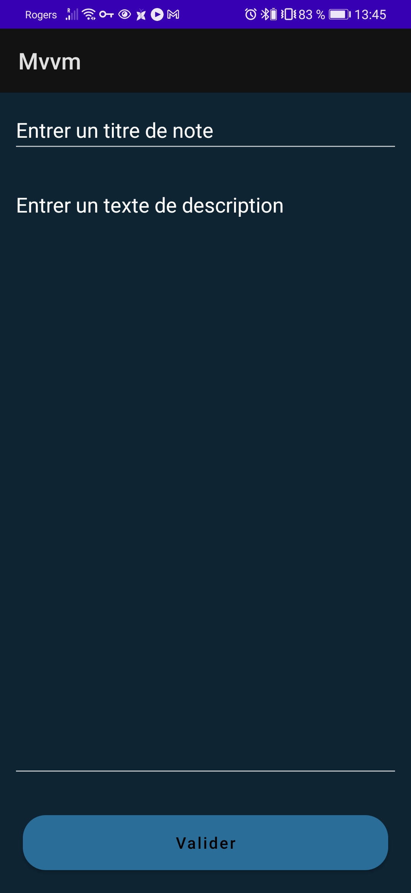

# Notepad

This project is an Android Nodepad app

## Stack

1. MVVM

## Guide
So as to running the app, you will need to download the project and loading on Android Studio. Launch the project on an emulator or in an android phone.

### Add
1. In order to add a new note. You have to click on the '+' button on the bottom of your screen 

2. Enter the title and the text of your note and validate. You will be redirected on the home page

### Updating
1. If you want to update a note, click on the title of the note that you want to change.

2. Update your text and validate your modification

### Deleting
1. To delete a note click on the trash button  

2. Your note have been successfuly deleted 

